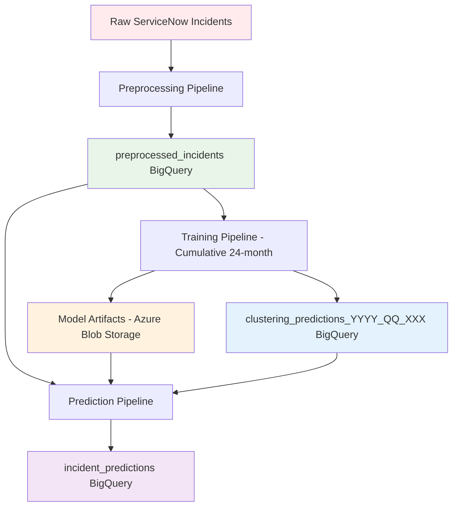

# HDBSCAN System Architecture

## 🏗️ **Complete System Overview**

The HDBSCAN incident classification system implements a **cumulative training approach** with **versioned model storage** across three main pipelines: Preprocessing, Training, and Prediction.

## 📊 **System Architecture Diagram**



## 🔄 **Pipeline Details**

### **1. 📝 PREPROCESSING PIPELINE**

**Purpose**: Transform raw incidents into ML-ready embeddings

**Input**: Raw ServiceNow incidents
**Output**: Cleaned text + 1536-dimensional embeddings

**Process Flow**:
```
Raw Incidents → Text Cleaning → Summarization → Embedding → Storage
```

**Storage Location**:
- **BigQuery Table**: `preprocessed_incidents`
- **Contents**: `number`, `sys_created_on`, `combined_incidents_summary`, `embedding`, `tech_center`
- **Storage Cost**: **HIGH** (1536-dim embeddings)
- **Retention**: 24-month rolling window

**Key Files**:
- `text_processing.py` - Text cleaning and summarization
- `embedding_service.py` - OpenAI embedding generation
- `main.py` - CLI interface

---

### **2. 🎯 TRAINING PIPELINE**

**Purpose**: Train HDBSCAN clustering models with cumulative approach

**Input**: 24-month cumulative data from `preprocessed_incidents`
**Output**: Trained models + domain mappings

**Process Flow**:
```
24-Month Data → UMAP Reduction → HDBSCAN Clustering → Domain Grouping → Versioned Storage
```

**Training Schedule**: **Semi-annual (every 6 months)**
- June 2025: Train on July 2023 → June 2025
- December 2025: Train on January 2024 → December 2025
- June 2026: Train on July 2024 → June 2026

**Storage Locations**:

#### **A) Model Artifacts → Azure Blob Storage**
```
hdbscan-models/
├── bt-tc-data-analytics/
│   ├── 2024_q4/          ← Previous model
│   │   ├── umap_model.pkl         (2.4 MB)
│   │   ├── hdbscan_model.pkl      (1.8 MB)
│   │   ├── umap_embeddings.npy    (156.7 MB)
│   │   ├── cluster_labels.npy     (0.7 MB)
│   │   └── model_metadata.json    (2.1 KB)
│   └── 2025_q2/          ← Current model
│       └── ...
└── bt-tc-network-operations/
    └── 2025_q2/
        └── ...
```

#### **B) Training Results → BigQuery**
- **Table**: `clustering_predictions_{year}_{quarter}_{hash}`
- **Example**: `clustering_predictions_2025_q2_789`
- **Contents**: `incident_number`, `cluster_id`, `cluster_label`, `domain_id`, `domain_name`, `umap_x`, `umap_y`, `tech_center`, `model_version`
- **Storage Cost**: **LOW** (no embeddings, only coordinates)

**Key Files**:
- `training_pipeline.py` - Main training orchestration
- `clustering_trainer.py` - HDBSCAN model training
- `training_orchestrator.py` - Multi-tech-center coordination

---

### **3. 🔮 PREDICTION PIPELINE**

**Purpose**: Classify new incidents using trained models

**Input**: New incidents from `preprocessed_incidents`
**Output**: Classification results

**Process Flow**:
```
New Incidents → Load Models (Blob) → Load Mappings (BigQuery) → Generate Predictions → Save Results
```

**Model Loading Strategy**:
1. **Model Artifacts**: Download from Azure Blob Storage
2. **Domain Mappings**: Query from versioned BigQuery table
3. **Prediction**: Apply UMAP + HDBSCAN models
4. **Results**: Save to `incident_predictions` (no embeddings)

**Storage Location**:
- **BigQuery Table**: `incident_predictions`
- **Contents**: `incident_id`, `predicted_cluster_id`, `predicted_cluster_label`, `confidence_score`, `predicted_domain_id`, `predicted_domain_name`, `domain_confidence`, `tech_center`, `prediction_timestamp`, `model_table_used`
- **Storage Cost**: **LOW** (no embeddings)

**Key Files**:
- `prediction_pipeline.py` - Main prediction logic
- `main.py` - Prediction CLI interface

## 💾 **Complete Storage Architecture**

### **BigQuery Tables**

| Table | Purpose | Storage Cost | Contents |
|-------|---------|--------------|----------|
| `preprocessed_incidents` | Source data | **HIGH** | Embeddings + text summaries |
| `clustering_predictions_YYYY_QQ_XXX` | Training results (versioned) | **LOW** | Cluster assignments + domain mappings |
| `incident_predictions` | Live predictions | **LOW** | Classification results only |

### **Azure Blob Storage**

| Container | Purpose | Storage Cost | Contents |
|-----------|---------|--------------|----------|
| `hdbscan-models` | Model artifacts | **MEDIUM** | Trained UMAP/HDBSCAN models |

## 🔗 **Data Flow Example**

### **Training Flow (Semi-annual)**:
```
1. Load 24-month data from preprocessed_incidents
2. Train HDBSCAN models (UMAP + clustering)
3. Save models to blob: hdbscan-models/bt-tc-data-analytics/2025_q2/
4. Save results to BigQuery: clustering_predictions_2025_q2_789
5. Link blob path in BigQuery metadata
```

### **Prediction Flow (2-hourly)**:
```
1. Load new incidents from preprocessed_incidents
2. Download models from blob: hdbscan-models/bt-tc-data-analytics/2025_q2/
3. Load domain mappings from: clustering_predictions_2025_q2_789
4. Generate predictions using blob models
5. Save results to incident_predictions (no embeddings)
```

## 💰 **Cost Optimization Strategy**

### **Storage Separation**:
- **Heavy embeddings**: Only in `preprocessed_incidents`
- **Light coordinates**: In versioned `clustering_predictions` tables
- **Model artifacts**: Efficient blob storage

### **Benefits**:
- **~50% BigQuery cost reduction** (no embedding duplication)
- **Optimal blob storage** for model artifacts
- **Clear data access patterns**
- **Easy model version management**

## 🎯 **Key Architectural Decisions**

1. **Cumulative Training**: 24-month rolling windows for pattern stability
2. **Versioned Tables**: New table per training cycle for clean isolation
3. **Hybrid Storage**: BigQuery for structured data, Blob for binary artifacts
4. **Cost Optimization**: Embeddings separated from downstream results
5. **Production Ready**: Clear deployment and rollback strategy

## 🚀 **Production Deployment**

### **Training Schedule**:
```bash
# Semi-annual training (automated)
python training_orchestrator.py --year 2025 --quarter q2

# Manual training for specific centers
python main.py train --tech-centers "BT-TC-Data Analytics" --quarters q2 --year 2025
```

### **Prediction Schedule**:
```bash
# 2-hourly predictions (automated)
python main.py predict

# Specific model version
python main.py predict --tech-center "BT-TC-Data Analytics" --model-year 2025 --model-quarter q2
```

### **Monitoring**:
```bash
# Check system status
python main.py status

# View storage information
python main.py info
```

## 📈 **Scalability Features**

- **Multi-tech-center support**: 15+ tech centers
- **Parallel processing**: Independent model training per center
- **Model versioning**: Easy A/B testing and rollback
- **Storage optimization**: Cost-effective at scale
- **Error resilience**: Comprehensive error handling

This architecture provides a **production-ready**, **cost-effective**, and **scalable** solution for incident classification with full traceability and model versioning! 🚀